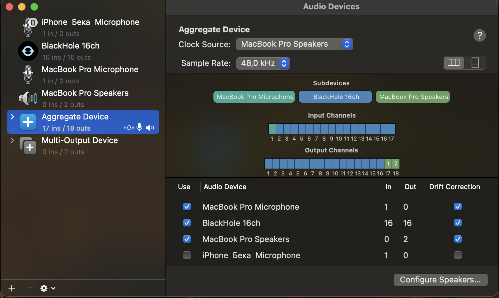
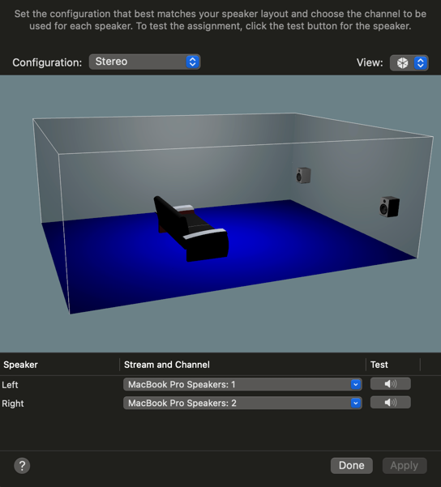

# 🎙️ Audio Parser — GUI Recorder with Transcript & Analytics

This macOS desktop application enables users to record both system and microphone audio, transcribe the recording, and analyze the content using AI. It is built with Python, Tkinter, and SQLite for a lightweight and responsive experience.

Use Case:
Before joining a daily meeting, simply launch the app and start recording. Once the meeting concludes, stop the recording and allow the application to automatically transcribe and analyze the conversation. This provides valuable insights and documentation without manual note-taking.

---

## 🚀 Features

- ✅ Record system + microphone audio via **Aggregate Device** (BlackHole + Built-in Mic)
- ✅ Save recordings locally as `.wav`
- ✅ Automatically transcribe using AssemblyAI
- ✅ Analyze transcript using custom AI logic
- ✅ Store metadata in **SQLite** database
- ✅ View & edit transcripts in GUI
- ✅ Display analytics per file
- ✅ Async-safe **loading indicator** during processing

---

## 🧰 Tech Stack

- Python 3.10+ (macOS)
- Tkinter
- SQLite3
- `sounddevice`, `soundfile`, `numpy`
- `python-dotenv` for managing API keys
- `pyinstaller` for packaging

---


## 🎛 Aggregate Device Setup
	
	1.	Install BlackHole 16ch
	2.	Open Audio MIDI Setup
	3.	Create an Aggregate Device combining:
		•	✅ Built-in Microphone
		•	✅ BlackHole 16ch
    	•	✅ MacBook Speakers
    4.  Set Clock Source to MacBook Speakers


#### Audio MIDI Setup(Pay attention to the order of subdevices):


#### Speakers Configuration:

---

## 📦 How to Run (Dev)

### Create an .env file. The template can be found in the project root directory(.env.example)

```bash
# 1. Clone the repo and navigate to the project
git clone https://github.com/mrbelka12000/audio_parser.git
cd audio_parser
```

```bash
pip install -r requirements.txt
```

```bash
python3 main.py 
```


---

## How to create application

```bash
python3 pyinstall.py
```

### Program will appear in *dist* directory and able to execute.

---

## 🧪 Usage
	•	Start Recording → Captures input/output audio
	•	Stop Recording → Triggers async transcription & analytics
	•	View Files → Browse stored recordings with full metadata
	•	Edit Transcript → Save changes in real-time -> Automatically update analytics

---

## 🚀 Next Steps

    •	📦 Package as a .dmg for easy macOS distribution
    •	🖥 Make cross-platform by supporting Windows and Linux
    •	🎛 Implement a visual progress bar during transcription & analytics
    •	💬 Add multi-language support for transcripts and UI
    •	☁️ Optional: Integrate with cloud storage (Dropbox, Google Drive) for recording backup
    •	📊 Add advanced analytics and visualizations for spoken content
    •	🧪 Add unit tests and CI for packaging validation across platforms

---
## 📬 Contact

If you have questions, feedback, or want to collaborate — feel free to reach out:

- 👤 **Beknur Karshyga**
- 📧 Email: [karshyga.beknur@gmail.com](mailto:karshyga.beknur@gmail.com)
- 💼 GitHub: [@mrbelka12000](https://github.com/mrbelka12000)
- 🌐 LinkedIn: [Beknur Karshyga](https://www.linkedin.com/in/beknur-karshyga)

Feel free to submit issues or feature requests through the GitHub repo as well!

---